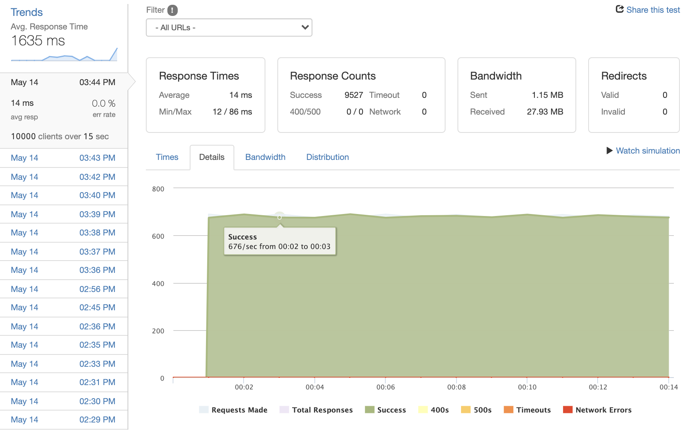

# SDC-Reviews-Service
<br />
<p align="left">
  <h1 align="left">System Design Capstone</h1>

  <p align="left">
    Custom-built RESTful API to support server and database operations for a high-end fashion website that can scale to meet the demands of production traffic.
    <br />
    <h3 align="left">
     <strong>Author »</strong>
    <a href="https://github.com/cmcrow2">Cam Crow</a>
     </h3>
  </p>
</p>

<!-- TABLE OF CONTENTS -->
<details open="open">
  <summary>Table of Contents</summary>
  <ol>
    <li>
      <a href="#about">About The Project</a>
      <ul>
        <li><a href="#stack">Built With</a></li>
      </ul>
    </li>
    <li><a href="#system-design">System Design</a></li>
    <li><a href="#database-and-etl">Database and ETL</a></li>
    <li><a href="#api-server">API Server</a></li>
    <li><a href="#optimization">Optimization</a></li>
    <li><a href="#deployment">Deployment</a></li>
    <li><a href="#stress-testing">Stress Testing</a></li>
    <li>
     <a href="#workflow">Workflow</a>
     <ul>
      <li><a href="#trello">Trello</a></li>
      <li><a href="#version-control">Version Control</a></li>
     </ul>
    </li>
    <li>
     <a href="#development">Development</a>
     <ul>
      <li><a href="#repo">Repo</a></li>
      <li><a href="#install">Install</a></li>
      <li><a href="#start-scripts">Start Scripts</a></li>
      <li><a href="#github-api-token">Github API token</a></li>
     </ul>
    </li>
  </ol>
</details>

# About
I was tasked with re-engineering the backend of the "Reviews" service of a mock fashion website frontend. I designed:
  * RESTful API to handle requests to a database system of my own choosing
  * ETL (Extract, Transform, Load) process on a raw, flawed data set consisting of over thirty million records
  * Design and build an API server to provide data to the client in the format specified by the API documentation
  * Optimize database and query methods for speed and response
  * Deploy to the cloud using AWS
  * Stress test all API routes, checking for RPS (requests per second), latency, and error rate via loader.io

The final product, when tested with <a href="https://loader.io">loader.io</a> with a maximum of 667 users per second, registered an average response time of 14 ms with a 0.0% error rate.




# Stack

<table>
  <tbody>
    <tr>
      <th>Programming Languages</th>
      <td>
        
        
      </td>
    </tr>
    <tr>
      <th>Tools & Technologies</th>
      <td>
        
        
      </td>
    </tr>
    <tr>
      <th>Utilities</th>
      <td>
        
        
        
      </td>
    </tr>
     <tr>
      <th>Workflow</th>
      <td>
        
        
        
        
        
      </td>
    </tr>
    <tr>
      <th>Deployment</th>
      <td>
        
      </td>
    </tr>
  </tbody>
</table>


# Workflow
Our team used Agile workflow for this project.

## Trello
A Trello board was used to create and track tickets. We held daily standup meetings to discuss accomplishments, challenges, and upcoming tickets. We utilitized Discord, Slack, and Zoom in order to maintain effective remote collaboration and allow for quick communication when necessary.

## Version Control
We utilized Git Feature Branch workflow. All pull requests in Github were reviewed by another team member before being merged into the main branch.

# Development

## Repo
`git clone https://github.com/Team-San-Antonio/SDC-Reviews-Service.git`

## Install
`npm install`

## Start Scripts
```
npm start
```

## Install Postgres
<a href="https://brew.sh/">Install Homebrew</a>

`brew install postgres`

<a href="https://www.postgresql.org/download/">Postgres Documentation</a>
